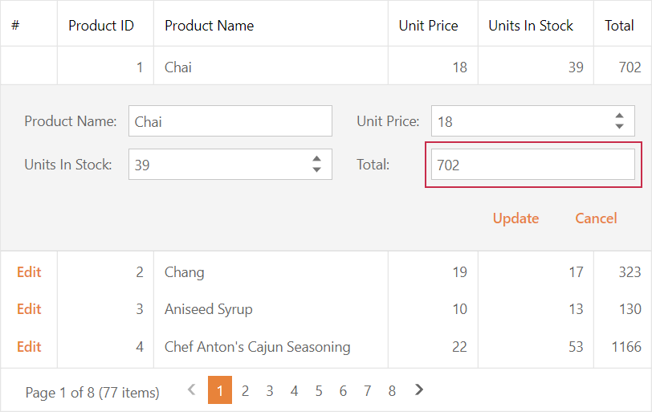

<!-- default badges list -->

<!-- default badges end -->
# Grid View for ASP.NET WebForms - How to assign calculated values to the Edit Form on the client and server sides
<!-- run online -->
**[[Run Online]](https://codecentral.devexpress.com/128535406/)**
<!-- run online end -->
This example demonstrates how to calculate a value in code based on column values and assign the calculated value to an editor within the Grid View edit form.

## Implementation Details

This example implements the client and server techniques described in the following Knowledge Base article:

- [KA18839: ASPxGridView - How to set column values in the Edit Form depending on another editor's value](https://www.devexpress.com/Support/Center/p/KA18839)

## Files to Look At

- [ClientSide.aspx](./CS/Solution/ClientSide.aspx) (VB: [ClientSide.aspx](./VB/Solution/ClientSide.aspx))
- [ClientSide.aspx.cs](./CS/Solution/ClientSide.aspx.cs) (VB: [ClientSide.aspx.vb](./VB/Solution/ClientSide.aspx.vb))
- [Default.aspx](./CS/Solution/Default.aspx) (VB: [Default.aspx](./VB/Solution/Default.aspx))
- [Default.aspx.cs](./CS/Solution/Default.aspx.cs) (VB: [Default.aspx.vb](./VB/Solution/Default.aspx.vb))
- [ServerSide.aspx](./CS/Solution/ServerSide.aspx) (VB: [ServerSide.aspx](./VB/Solution/ServerSide.aspx))
- [ServerSide.aspx.cs](./CS/Solution/ServerSide.aspx.cs) (VB: [ServerSide.aspx.vb](./VB/Solution/ServerSide.aspx.vb))

## Documentation 

- [Edit Data](https://docs.devexpress.com/AspNet/3712/components/grid-view/concepts/edit-data)

## More Examples

- [ASPxGridView - How to calculate column values on the client side using DataItemTemplate](https://www.devexpress.com/Support/Center/p/E3929)
